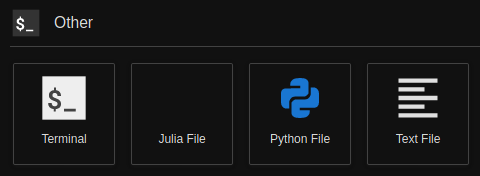

# jupyterlab-julia-file

WARNING: 1st version NEED TO BE TESTED!!!!!!!

To create Julia files (`.jl`) from JupyterLab launcher editor.

Extension adapted from https://github.com/jtpio/jupyterlab-python-file



## Prerequisites

* JupyterLab 1.0

## Installation

```bash
jupyter labextension install @arcticsnow/jupyterlab-julia-file
```

## Development

For a development install (requires npm version 4 or later), do the following in the repository directory:

```bash
npm install
npm run build
jupyter labextension install .
```

To rebuild the package and the JupyterLab app:

```bash
npm run build
jupyter lab build
```

